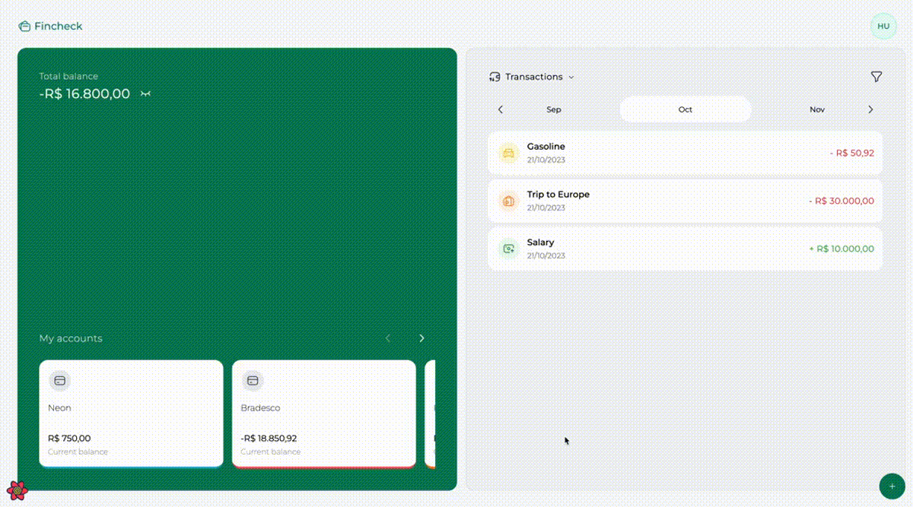
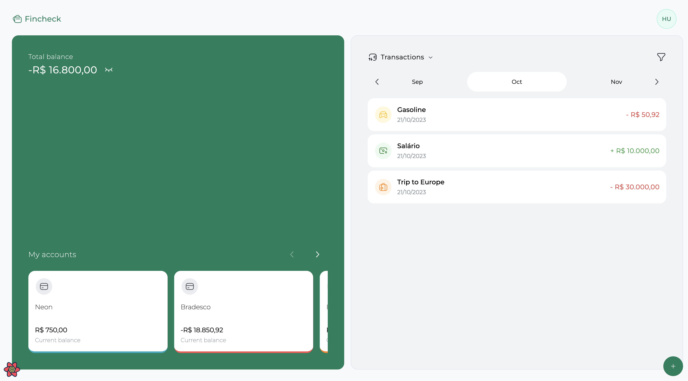
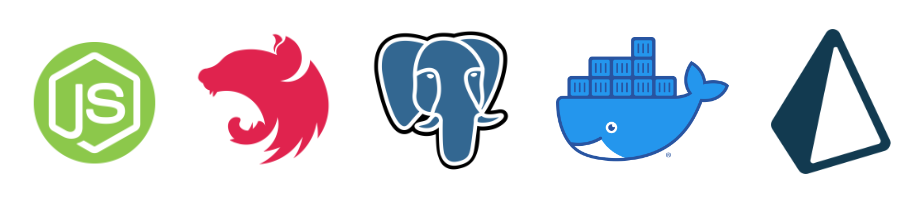

# FINCHECK - App to manage your finances and budget





## FINCHECK BACKEND - API
### STACK USED TO BUILD THE PROJECT

<p align-items="center" justify-content="center">
  
</p>

Out backend is built using [Node.js](https://nodejs.org/) with [Nest](https://nestjs.com/).

The Database we chose to implement in the Fincheck was [Postgres](https://www.postgresql.org/) with [Prisma](https://www.prisma.io/) as our ODM (Object Data Modelling).

The port we are using for the Database to be running is **5432** and we are using [Docker](https://www.docker.com/) to run it.

We organized the application in modules, each module folder contains its respectives dtos, entities and services, not all have the same sequence of folders due to specific cases of each.

## TO RUN THE PROJECT

Since we are using [Yarn](https://yarnpkg.com/) as our Package Manager we will run the commands using **yarn**.

- To run in Development mode we use the command:

```javascript
yarn start:dev
```

- To run our backend in Production Mode we will use the command:

```javascript
yarn build
```

This command will execute node and the folder dist which contains the code of our backend/server turned into Javascript

## FINCHECK FRONTEND - WEB APPLICATION

<p align-items="center" justify-content="center">
  
</p>

The project was built using [React.js](https://react.dev/) and [Vite](https://vitejs.dev/) with [Yarn](https://yarnpkg.com/) as out package manager.

As for the UI, we've used [TailwindCSS](https://tailwindcss.com/), [Clsx](https://www.npmjs.com/package/clsx) to style it with the help of [Headless UI](https://headlessui.com/) to get the animations and also [Radix](https://www.radix-ui.com/) to style our modals, dropdowns, select, dialogs and other components.
Also, we've used [Swiper](https://swiperjs.com/) for the account cards, transaction months we have in our application.
To display toast notifications we used [React-Hot-Toast](https://react-hot-toast.com/).
A calendar was implemented and for that we used a library called [React Day Picker](https://react-day-picker.js.org/). To handle the values of balance, transactions we used a number library called [React-Number-Format](https://github.com/s-yadav/react-number-format#readme).

To handle the forms across our applications we've used [React-Hook-Form](https://react-hook-form.com/) in combination with [Zod](https://zod.dev/)

These are the steps to execute our project:

- To run in Development mode we use the command:

```javascript
yarn dev
```

The command yarn dev will execute vite.

- To run the command to build the project we use:

```javascript
yarn build
```

The command yarn build will execute tsc which means Typescript Compiler that will turn the Typescript code into Javascript to be understood by the browsers.


## API COMSUME USING AXIOS & REACT QUERY

To handle our requests to the backend we are using [Axios](https://axios-http.com/) and also [React Query](https://tanstack.com/query/v4/).